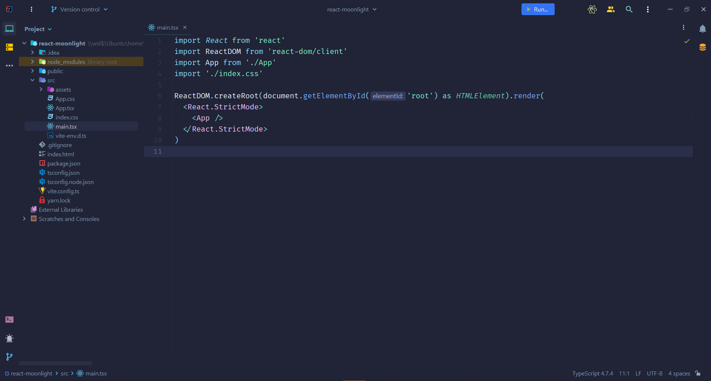
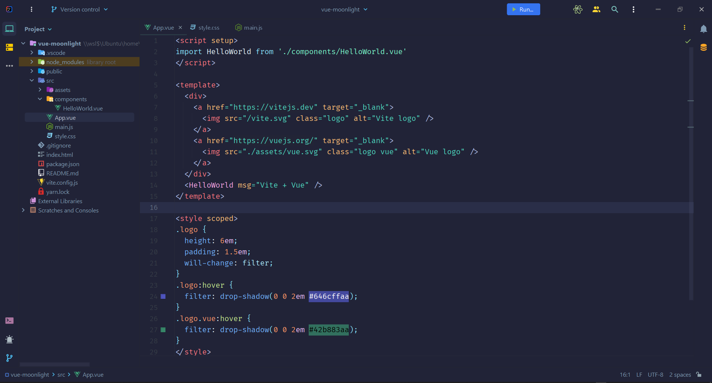
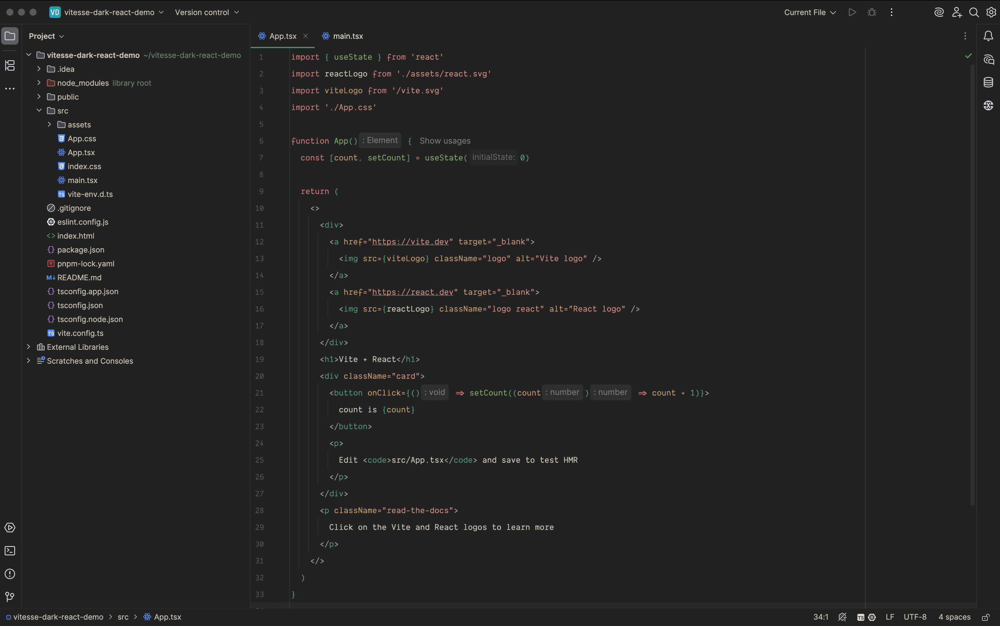

<h1 align="center">🌌 Moonlight Theme for JetBrains</h1>

  <em>A serene dark theme for your longest and most creative coding nights.  
  Inspired by the tranquil tones of <a href="https://marketplace.visualstudio.com/items?itemName=atomiks.moonlight">Moonlight for VS Code</a>, now crafted natively for JetBrains IDEs.</em>

  
  
  

---

## 📸 Preview Gallery

Glance at Moonlight in your favorite frameworks:

  
  
  

---

## ✨ Features

✅ **Modern & Minimal** – Designed for comfort, clarity and elegance.  
🎯 **Focus-Friendly** – Soothing colors that reduce eye strain and increase productivity.  
⚙️ **Framework Agnostic** – Whether it’s React, Angular, Vue, Python or Rust, Moonlight adapts.  
🎨 **Harmonized UI** – Panels, trees, tabs and popups all styled with consistency.

---

## 🚀 How to Install

1. Open **JetBrains IDE** → `Settings | Plugins`
2. Search for `Moonlight Theme` and click **Install**
3. Restart your IDE
4. Go to `Settings | Appearance & Behavior | Appearance`
5. Select **Moonlight Theme** from the dropdown

> 🌓 You're ready to code in Moonlight.

---

## 🆕 What’s New in v1.11 (Q3 2025)

- 🎨 Improved contrast and accent adjustments
- 🗂️ Increased tree view spacing for cleaner navigation
- 🧩 Panel and background fixes for smoother experience
- ✨ Color refinements to better match the original inspiration
- 🧪 Compatibility: Fully tested with IntelliJ 2025.1 and newer

---

## ⚡ Bonus: Try My New Theme — Vitesse Dark

  

Love speed, contrast, and bold design?  
Check out my brand new theme inspired by Vitesse:

👉 **[Vitesse Dark Theme – Now on JetBrains Marketplace](https://plugins.jetbrains.com/plugin/28084-vitesse-dark-theme)**

It’s fast. It’s clean. It hits different. 🏎️

---

## 💖 Support & Contribute

If Moonlight helps brighten your dev nights, please consider:

- ⭐ Star this repo
- 🗣️ Share feedback or open issues
- 🤝 [Sponsor on GitHub](https://github.com/franmc01)
- 🧠 Suggest color tweaks, icons or layout fixes

This project is for the community, by the community. Let's evolve it together.

---

## 🙏 Acknowledgements

- ✨ [@atomiks](https://github.com/atomiks) for the original Moonlight vision
- 💼 JetBrains for their amazing developer tools
- 🤍 Everyone who installs, uses, and shares feedback

---

  <strong>Moonlight Theme</strong> is lovingly crafted by <a href="https://github.com/franmc01">Francisco Marín</a> 💻

